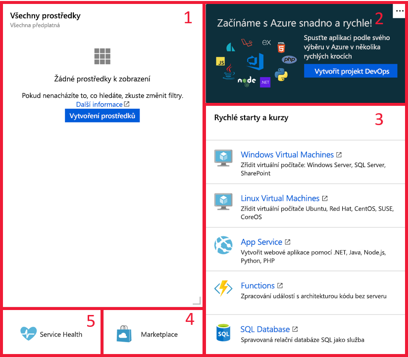

Dále se podívejme na to, jak vytvářet a upravovat řídicí panely na webu Azure Portal a pomocí přímých úprav základního souboru JSON. V této lekci se naučíte, jak si s tím poradit, a v další lekci si prakticky vyzkoušíte, co jste se naučili.

## Co je řídicí panel?

_Řídicí panel_ je přizpůsobitelná kolekce dlaždic uživatelského rozhraní, která se zobrazí na webu Azure Portal. Požadované zobrazení vytvoříte tak, že budete přidávat, odebírat a umisťovat dlaždice, a potom ho uložíte jako řídicí panel. Řídicích panelů může být několik a vy mezi nimi můžete přepínat podle potřeby. Své řídicí panely můžete dokonce sdílet s dalšími členy týmu.

Řídicí panely vám dávají značnou flexibilitu při správě Azure. Můžete například vytvořit řídicí panely pro určité role v organizaci a pak pomocí řízení přístupu na základě role (RBAC) určit, kdo má k těmto řídicím panelům přístup. Váš správce databáze by tak měl řídicí panel obsahující zobrazení databázové služby SQL, zatímco správce služby Azure Active Directory by měl k dispozici zobrazení uživatelů a skupin ve službě Azure AD. Vytvořením zvláštních řídicích panelů pro každé prostředí, které spravujete, můžete portál dokonce přizpůsobit pro produkční a vývojové prostředí.

Řídicí panely se ukládají do souborů JSON (JavaScript Object Notation). To znamená, že je můžete nahrát nebo stáhnout do jiného počítače, případně sdílet se členy adresáře Azure. Azure ukládá řídicí panely ve skupinách prostředků podobně jako virtuální počítače nebo účty úložiště, které můžete spravovat na portálu.

> [!TIP]
> Protože jsou řídicí panely tvořeny soubory JSON, můžete je také [přizpůsobit programově](https://docs.microsoft.com/azure/azure-portal/azure-portal-dashboards-create-programmatically), což z nich dělá nepřekonatelné nástroje pro správu. Kromě toho můžou být některé typy dlaždic založené na dotazech, takže se při změně zdrojových dat aktualizují automaticky.

## Zkoumání výchozího řídicího panelu

Výchozí řídicí panel má název Řídicí panel. Po prvním přihlášení na portál se vám zobrazí tento řídicí panel obsahující čtyři dlaždice.

Výchozí webové součásti jsou tyto:

1. Ovládací prvky řídicího panelu

1. Dlaždice všech prostředků

1. Dlaždice rychlých startů a kurzů

1. Dlaždice Service Health

1. Dlaždice Marketplace

## Vytváření a správa řídicích panelů

V horní části řídicího panelu jsou ovládací prvky, které vám umožňují řídicí panel vytvořit, nahrát, stáhnout, upravit a sdílet. Řídicí panel můžete také přepnout do zobrazení na celé obrazovce, naklonovat nebo odstranit.

## Výběr řídicího panelu

Úplně vlevo na panelu nástrojů se nachází rozevírací seznam pro **výběr řídicího panelu**. Po kliknutí na tento ovládací prvek můžete vybírat z řídicích panelů, které už jste pro svůj účet definovali. Tento ovládací prvek umožňuje snadno definovat různé řídicí panely pro různé účely a potom mezi nimi přepínat podle toho, co se zrovna chystáte dělat.

Všechny řídicí panely, které vytvoříte, budou ze začátku soukromé, takže je uvidíte jenom vy. Pokud chcete, aby byl řídicí panel dostupný v rámci celého podniku, musíte ho nasdílet. Na tuto možnost se podíváme za chvíli.

## Vytvoření nového řídicího panelu

Pokud chcete vytvořit nový řídicí panel, klikněte na **Nový řídicí panel**. Zobrazí se pracovní prostor řídicího panelu bez dlaždic. Dlaždice potom můžete přidávat, odebírat a upravovat podle svých představ. Jakmile přizpůsobení řídicího panelu dokončíte, klikněte na **Přizpůsobení dokončeno**. Tím řídicí panel uložíte a přepnete na něj.

## Nahrávání a stahování

Tlačítka **Nahrát** a **Stáhnout** vám umožňují stáhnout aktuální řídicí panel jako soubor JSON, přizpůsobit ho a potom ho distribuovat a nahrát nebo ho předat někomu jinému, aby soubor nahrál zpátky na web Azure Portal a nahradil tak aktuální řídicí panel.

Pokud kliknete na **Stáhnout**, aktuální řídicí panel stáhne kód JSON jako soubor, který můžete upravit místně. Potom kliknutím na tlačítko **Nahrát** můžete soubor nahrát zpět do Azure. Tomu se budeme věnovat později.

## Úprava řídicího panelu na portálu

Řídicí panel sice můžete upravit tak, že stáhnete soubor JSON, změníte v něm hodnoty a nahrajete ho zpátky do Azure, ale takový přístup k návrhu uživatelského rozhraní není intuitivní. Pokud chcete konfigurovat aktuální řídicí panel pomocí grafického uživatelského rozhraní, můžete do režimu úprav přejít několika způsoby:

1. Klikněte na tlačítko **Upravit** (ikona tužky).
1. Pravým tlačítkem myši klikněte na oblast pozadí a vyberte **Upravit**.
1. Kliknutím pravým tlačítkem myši na dlaždici otevřete nabídku s možnostmi úprav.
1. Najeďte myší na dlaždici na řídicím panelu a v pravém horním rohu se zobrazí nabídka `...` s možnostmi úprav.

Řídicí panel se přepne do režimu úprav.

Na levé straně se zobrazí galerie dlaždic s řadou dostupných dlaždic. Galerii dlaždic můžete filtrovat podle kategorie a typu prostředku.

K přidání dlaždice stačí dlaždici vybrat ze seznamu vlevo a přetáhnout ji do pracovní oblasti. Potom můžete jednotlivé dlaždice přesunout, upravit jejich velikost nebo změnit zobrazovaná data.

> [!TIP]
> Skvělou funkcí, o které mnoho lidí neví, je možnost umístit na řídicí panel prvky z podřízených oken. Stačí najet myší na požadovanou položku a najít nabídku pro úpravu dlaždice `...`. Bude obsahovat možnost Připnout na řídicí panel, která umožňuje rychle umístit dlaždici ze služby na řídicí panel.

Pracovní oblast je v režimu úprav rozdělená na čtverce. Každá dlaždice musí zabírat alespoň jeden čtverec a dlaždice se přichytávají k nejbližší největší sadě rozdělovačů mezi dlaždicemi. Pokud se dlaždice překrývají, dojde k jejich přesunutí. Když některou dlaždici zmenšíte, okolní dlaždice se k ní přisunou.

#### Změna velikosti dlaždic

Některé dlaždice mají nastavenou velikost, kterou můžete změnit jen programově. Dlaždice s šedým pravým dolním rohem ale můžete upravit přetažením ukazatele tohoto rohu.

Případně můžete kliknout pravým tlačítkem na místní nabídku a zadat požadovanou velikost.

Při vytváření řídicího panelu přetahujete dlaždice z galerie dlaždic do pracovního prostoru a potom změníte jejich uspořádání.

#### Změna nastavení dlaždic

Některé dlaždice umožňují úpravu nastavení. Když například přetáhnete do pracovního prostoru dlaždici s hodinami, otevře se dlaždice **Upravit hodiny**. Potom můžete nastavit časové pásmo, které se má na dlaždici zobrazovat, a také 12hodinový nebo 24hodinový formát času.

Pro potřeby nadnárodních společností můžete přidat další hodiny v různých časových pásmech.

#### Přijetí úprav

Až dlaždice uspořádáte podle svých představ, klikněte na **Přizpůsobení dokončeno** nebo klikněte pravým tlačítkem myši a potom klikněte na **Přizpůsobení dokončeno**.

## Úprava řídicího panelu změnou souboru JSON

Řídicí panel můžete také upravit změnou souboru JSON. Tento přístup nabízí více možností změny nastavení, ale změny neuvidíte, dokud soubor nenahrajete zpátky do Azure. Nejsnáze začnete tak, že stáhnete soubor JSON řídicího panelu, jak jsme dříve popsali, a tento soubor upravíte.

Ve výše uvedeném souboru JSON byste například změnili velikost dlaždice tak, že byste upravili proměnné **colSpan** a **rowSpan**, potom soubor uložili a nahráli ho zpátky do Azure.

> [!Tip]
> Soubor JSON řídicího panelu můžete také distribuovat jiným uživatelům.

## Resetování řídicího panelu

Každý řídicí panel můžete resetovat do výchozího stavu. V režimu úprav klikněte pravým tlačítkem myši na pozadí řídicího panelu a vyberte **Resetovat do výchozího stavu**. Zobrazí se dialogové okno s žádostí o potvrzení, že chcete řídicí panel resetovat.

## Sdílení nebo zrušení sdílení řídicího panelu

Když definujete nový řídicí panel, je soukromý a vidí ho jenom váš účet. Pokud chcete, aby řídicí panel viděli i ostatní, je potřeba ho sdílet. Stejně jako v případě jiných prostředků Azure je však potřeba zadat novou skupinu prostředků (nebo použít existující skupinu prostředků), do které se mají sdílené řídicí panely uložit. Pokud nemáte žádnou existující skupinu prostředků, Azure vytvoří ve vámi zadaném umístění skupinu prostředků *dashboards*. Pokud máte existující skupiny prostředků, můžete určit, do které z nich se mají řídicí panely uložit.

Po sdílení šablony se zobrazí druhé okno **Sdílení a řízení přístupu**.

Potom můžete kliknout na **Spravovat uživatele** a určit, kteří uživatelé mají mít přístup k danému řídicímu panelu.

### Přepnutí na sdílený řídicí panel

Pokud chcete přepnout na sdílený řídicí panel, klikněte na seznam řídicích panelů a potom na **Procházet všechny řídicí panely**.

Teď se zobrazí okno **Všechny řídicí panely**, které obsahuje názvy všech sdílených řídicích panelů. Pokud chcete některý řídicí panel použít na webu Azure Portal, stačí na něj kliknout.

## Zobrazení řídicího panelu na celé obrazovce

Pokud chcete řídicí panel zobrazit na maximální ploše, kliknutím na tlačítko **Celá obrazovka** se aktuální řídicí panel zobrazí bez nabídek prohlížeče.  Pokud některé dlaždice leží mimo hranice obrazovky, zobrazí se v pravé a dolní části obrazovky posuvníky.

Po dokončení práce v režimu celé obrazovky stiskněte klávesu ESC nebo v horní části obrazovky vedle názvu řídicího panelu klikněte na **Ukončit režim celé obrazovky**.

## Klonování řídicího panelu

Klonováním řídicího panelu vytvoříte okamžitou kopii s názvem „Klon řídicího panelu \<název_řídicího_panelu>“ a na tuto kopii se přepnete jako na aktuální řídicí panel. Klonování je také snadný způsob, jak vytvořit řídicí panely před jejich sdílením. Pokud například máte řídicí panel, který se blíží vaší představě, můžete ho naklonovat, provést potřebné změny a potom ho nasdílet.

## Odstranění řídicího panelu

Odstraněním řídicího panelu ho odeberete ze seznamu dostupných řídicích panelů. Při odstranění se zobrazí výzva žádající potvrzení, ale neexistuje žádný způsob, jak odstraněný řídicí panel obnovit.

Pojďme si některé z těchto možností vyzkoušet při vytváření nového řídicího panelu.
