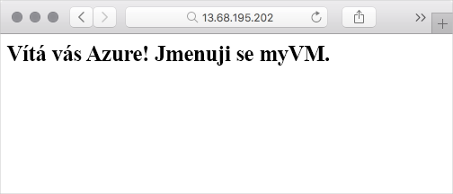

Teď, když je virtuální počítač v provozu, ho můžete začít používat. Zde nainstalujete webový server a poskytnete základní webovou stránku, která bude zobrazovat název hostitele virtuálního počítače.

Pokud chcete konfigurovat virtuální počítač, máte několik možností. Můžete se připojit přímo a systém nakonfigurovat interaktivně. V systémech Windows můžete například vytvořit relaci Vzdálené plochy a připojit se k uživatelskému rozhraní vzdáleného počítače s Windows, jako byste seděli přímo u něho. U systémů Linux můžete vytvořit připojení SSH a zabezpečeně pracovat se vzdáleným systémem Linux z terminálu.

Ruční konfigurace je dobrý začátek, ale jak budou systémy přibývat, můžete svá nasazení automatizovat. Automatizace zahrnuje běžící opakovatelné procesy, jako jsou programy a skripty, které se za vás postarají o těžkou práci.

::: zone pivot="windows-cloud"

Zde vzdáleně nakonfigurujete službu IIS z relace Cloud Shellu pomocí funkce virtuálních počítačů Azure s Windows, která se nazývá Rozšíření vlastních skriptů.

::: zone-end

::: zone pivot="linux-cloud"

Zde vzdáleně nakonfigurujete službu Nginx z relace Cloud Shellu pomocí funkce virtuálních počítačů Azure na bázi Linuxu, která se nazývá rozšíření vlastních skriptů.

::: zone-end

::: zone pivot="windows-cloud"

## <a name="what-is-iis"></a>Co je služba IIS?

Internetová informační služba neboli IIS je webový server, který běží ve Windows. Můžete poskytovat standardní webový obsah (HTML, CSS a JavaScript) nebo provozovat webové aplikace typu ASP.NET i dalších typů. Služba IIS se dodává s Windows Serverem, ale je potřeba ji aktivovat, aby začala poskytovat webové stránky.

## <a name="whats-the-custom-script-extension"></a>Co je rozšíření vlastních skriptů?

Rozšíření vlastních skriptů představuje snadný způsob, jak stahovat a spouštět skripty na virtuálních počítačích Azure. Je to jen jeden z mnoha způsobů, jak můžete systém nakonfigurovat po zprovoznění virtuálního počítače.

Skripty můžete ukládat v úložišti Azure nebo ve veřejném umístění, jako je GitHub. Skripty můžete spouštět ručně nebo v rámci automatizovanějšího nasazení. Tady spustíte příkaz na rozhraní příkazového řádku Azure pro stažení skriptu PowerShellu z GitHubu a jeho spuštění na virtuálním počítači. Skript nakonfiguruje službu IIS.

## <a name="configure-iis"></a>Konfigurace služby IIS

<!-- TODO: https://github.com/MicrosoftDocs/learn-pr/issues/1864 -->

Tady rozšíření vlastních skriptů použijete ke vzdálené konfiguraci služby IIS na vašem virtuálním počítači ze služby Cloud Shell. Také nakonfigurujete firewall tak, aby povoloval příchozí síťový přístup na portu 80 (HTTP).

1. Ze služby Cloud Shell spusťte příkaz `az vm extension set` – tím stáhnete a spustíte skript PowerShellu, který nainstaluje službu IIS a nakonfiguruje základní domovskou stránku.

    ```azurecli
    az vm extension set \
      --resource-group <rgn>[sandbox resource group name]</rgn> \
      --vm-name myVM \
      --name CustomScriptExtension \
      --publisher Microsoft.Compute \
      --settings '{"fileUris":["https://raw.githubusercontent.com/MicrosoftDocs/mslearn-welcome-to-azure/master/configure-iis.ps1"]}' \
      --protected-settings '{"commandToExecute": "powershell -ExecutionPolicy Unrestricted -File configure-iis.ps1"}'
    ```

    Proces konfigurace služby IIS, nastavení obsahu domovské stránky a spuštění této služby trvá několik minut.

    Pokud budete chtít, můžete si v mezičase [příslušný skript PowerShellu prostudovat](https://raw.githubusercontent.com/MicrosoftDocs/mslearn-welcome-to-azure/master/configure-iis.ps1?azure-portal=true) na samostatné kartě prohlížeče. Tento skript nainstaluje službu IIS a nakonfiguruje domovskou stránku tak, aby zobrazovala uvítací zprávu a název virtuálního počítače: „myVM“.

1. Spuštěním příkazu `az vm open-port` otevřete port 80 (HTTP) na firewallu.

    ```azurecli
    az vm open-port \
      --name myVM \
      --resource-group <rgn>[sandbox resource group name]</rgn> \
      --port 80
    ```

## <a name="verify-the-configuration"></a>Ověření konfigurace

Teď když je služba IIS nastavená, ověřme, že je i spuštěná.

1. Spuštěním příkazu `az vm show` zobrazte veřejnou IP adresu vašeho virtuálního počítače.

    ```azurecli
    az vm show \
      --name myVM \
      --resource-group <rgn>[sandbox resource group name]</rgn> \
      --show-details \
      --query [publicIps] \
      --output tsv
    ```

    Zobrazí se veřejná IP adresa vašeho virtuálního počítače, například 104.211.9.245.

1. Na nové kartě prohlížeče přejděte na IP adresu virtuálního počítače (zobrazuje se jako `http://` a příslušná IP adresa). Zobrazí se uvítací zpráva a název virtuálního počítače.

    

    Pokud se uvítací zpráva nezobrazí:

    * Zkontrolujte, že používáte IP adresu virtuálního počítače, a nikoli IP adresu zobrazenou v některém z příkladů.
    * Zkontrolujte, že jste spustili příkaz `az vm open-port` zobrazený výše a otevřeli jste port 80 (HTTP) přes bránu firewall.
    * Chvíli počkejte a pak stránku aktualizujte. Přestože je služba IIS nainstalovaná, nemusela se ještě úplně spustit.

::: zone-end

::: zone pivot="linux-cloud"

## <a name="what-is-nginx"></a>Co je Nginx?

Nginx (vyslovuje se jako anglické sousloví „engine-x“) je oblíbený bezplatný open-source webový server, který běží v systémech Unix, Linux, macOS a Windows. Zde Nginx použijete k zobrazení základní webové stránky.

## <a name="whats-the-custom-script-extension"></a>Co je rozšíření vlastních skriptů?

Rozšíření vlastních skriptů představuje snadný způsob, jak stahovat a spouštět skripty na virtuálních počítačích Azure. Je to jen jeden z mnoha způsobů, jak můžete systém nakonfigurovat po zprovoznění virtuálního počítače.

Skripty můžete ukládat v úložišti Azure nebo ve veřejném umístění, jako je GitHub. Skripty můžete spouštět ručně nebo v rámci automatizovanějšího nasazení. Tady spustíte příkaz na rozhraní příkazového řádku Azure pro stažení skriptu Bash z GitHubu a jeho spuštění na virtuálním počítači. Skript nakonfiguruje službu Nginx.

## <a name="configure-nginx"></a>Konfigurace služby Nginx

<!-- TODO: https://github.com/MicrosoftDocs/learn-pr/issues/1864 -->

Tady rozšíření vlastních skriptů použijete ke vzdálené konfiguraci služby Nginx na vašem virtuálním počítači ze služby Cloud Shell. Také nakonfigurujete firewall tak, aby povoloval příchozí síťový přístup na portu 80 (HTTP).

1. Z Cloud Shellu spusťte příkaz `az vm extension set` – tím stáhnete a spustíte skript Bash, který nainstaluje Nginx a nakonfiguruje základní domovskou stránku.

    ```azurecli
    az vm extension set \
      --resource-group <rgn>[sandbox resource group name]</rgn> \
      --vm-name myVM \
      --name customScript \
      --publisher Microsoft.Azure.Extensions \
      --settings '{"fileUris":["https://raw.githubusercontent.com/MicrosoftDocs/mslearn-welcome-to-azure/master/configure-nginx.sh"]}' \
      --protected-settings '{"commandToExecute": "./configure-nginx.sh"}'
    ```

    Proces konfigurace služby Nginx, nastavení obsahu domovské stránky a spuštění této služby trvá několik minut.

    Pokud budete chtít, můžete si v mezičase [příslušný skript Bash prostudovat](https://raw.githubusercontent.com/MicrosoftDocs/mslearn-welcome-to-azure/master/configure-nginx.sh?azure-portal=true) na samostatné kartě prohlížeče. Tento skript nainstaluje službu Nginx a nakonfiguruje domovskou stránku tak, aby zobrazovala uvítací zprávu a název virtuálního počítače: „myVM“.

1. Spuštěním příkazu `az vm open-port` otevřete port 80 (HTTP) na firewallu.

    ```azurecli
    az vm open-port \
      --name myVM \
      --resource-group <rgn>[sandbox resource group name]</rgn> \
      --port 80
    ```

## <a name="verify-the-configuration"></a>Ověření konfigurace

Teď když je Nginx nastavený, ověřme, že je i spuštěný.

1. Spuštěním příkazu `az vm show` zobrazte veřejnou IP adresu vašeho virtuálního počítače.

    ```azurecli
    az vm show \
      --name myVM \
      --resource-group <rgn>[sandbox resource group name]</rgn> \
      --show-details \
      --query [publicIps] \
      --output tsv
    ```

    Zobrazí se veřejná IP adresa vašeho virtuálního počítače, například 104.211.9.245.

1. Na nové kartě prohlížeče přejděte na IP adresu virtuálního počítače. Zobrazí se uvítací zpráva a název virtuálního počítače.

    

    Pokud se uvítací zpráva nezobrazí:

    * Zkontrolujte, že používáte IP adresu virtuálního počítače, a nikoli IP adresu zobrazenou v některém z příkladů.
    * Zkontrolujte, že jste spustili příkaz `az vm open-port` zobrazený výše a otevřeli jste port 80 (HTTP) přes bránu firewall.
    * Chvíli počkejte a pak stránku aktualizujte. Přestože je služba Nginx nainstalovaná, nemusela se ještě úplně spustit.

::: zone-end

## <a name="summary"></a>Shrnutí

Váš virtuální počítač běží a můžete teď poskytovat webové stránky, ale co to pro vás znamená?

Nezapomeňte, že každá cesta začíná úplně základními kroky a téměř všechny skvělé inovace v cloudu, u velkých i malých společností, začaly podobným nastavením, jaké jste právě dokončili. Jak se vaše idea bude vyvíjet, začne se projevovat její pozitivní dopad na vaši firmu i vaše uživatele.