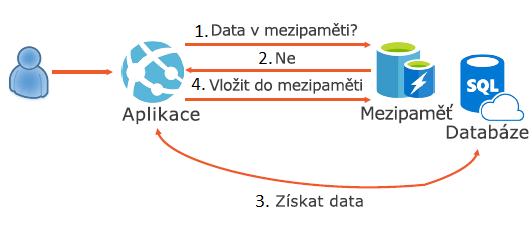
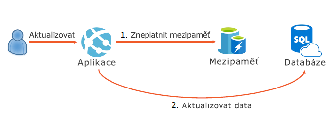

Když sestavujete aplikaci, chcete poskytovat skvělý uživatelský komfort, jehož součástí je rychlé načítání dat. Načítání dat z databáze je obvykle zdlouhavý proces a může být pro uživatele nepříjemný, pokud jsou tato data čtena často. Model doplňování do mezipaměti popisuje, jak můžete implementovat mezipaměť ve spojení s databází pro co nejrychlejší návrat nejčastěji používaných dat.

Zde se dozvíte, jak jde model doplňování do mezipaměti použít k tomu, aby se dalo rychle přistupovat k důležitým datům.

## Co je model doplňování do mezipaměti?

Model doplňování do mezipaměti určuje, že když potřebujete načíst data ze zdroje dat, jako je relační databáze, měli byste nejprve hledat tato data v mezipaměti. Když jsou data v mezipaměti, použijte je. Pokud data v mezipaměti nejsou, zadejte dotaz databázi a při vracení dat zpět uživateli je přidejte do mezipaměti. To vám v budoucnu umožní přistupovat k datům z mezipaměti, když budou potřeba.

## Kdy implementovat model doplňování do mezipaměti?

Čtení dat z databáze je obvykle pomalý proces. Zahrnuje kompilaci komplexního dotazu, přípravu plánu provedení dotazu, provedení dotazu a následnou přípravu výsledku. V některých případech může tento proces číst data také z disku. Existují optimalizace, které se dají provést na úrovni databáze, jako je předkompilace dotazů a načtení některých dat v paměti. Při načítání dat z databáze ale vždy dojde ke spuštění dotazu a přípravě výsledku.

Tento problém můžeme vyřešit modelem doplňování do mezipaměti. V modelu doplňování do mezipaměti máme stále aplikaci a databázi, ale teď také mezipaměť. Mezipaměť ukládá data do paměti, ale nemusí provádět interakci se systémem souborů. Mezipaměti také ukládají data do velmi jednoduchých datových struktur, jako jsou páry hodnot klíčů, takže nemusí provádět složité dotazy k získání dat nebo zachování indexů při zápisu dat. Z tohoto důvodu je mezipaměť obvykle výkonnější než databáze. Když používáte aplikaci, pokusí se načíst data nejprve z mezipaměti. Pokud požadovaná data nejsou v mezipaměti, aplikace je načte z databáze, jako to dělala vždy. Poté však uloží data do mezipaměti pro následné požadavky. Když si příště nějaký uživatel data vyžádá, vrátí je přímo z mezipaměti.

### Správa aktualizace dat

Když implementujete model doplňování do mezipaměti, vznikne malý problém. Protože jsou vaše data nyní uložena v mezipaměti a úložišti dat, můžete narazit na problémy při aktualizaci. K aktualizaci dat byste například potřebovali aktualizovat mezipaměť i úložiště dat.

Řešením tohoto problému v modelu doplňování do mezipaměti je zneplatnění dat v mezipaměti. Když aktualizujete data v aplikaci, měli byste nejdřív odstranit data v mezipaměti a pak provést změny zdroje dat přímo. Díky tomu při příštím vyžádání nebudou data v mezipaměti a proces se bude opakovat. 

## Důležité informace pro používání modelu doplňování do mezipaměti

Pečlivě zvažte, která data se mají do mezipaměti ukládat. Ne všechna data jsou pro uložení v mezipaměti vhodná.

- **Životnost**: Aby bylo doplňování do mezipaměti efektivní, ujistěte se, že zásada vypršení platnosti odpovídá frekvenci přístupu k datům. Nastavení příliš krátké doby vypršení platnosti může mít za následek to, že aplikace budou průběžně načítat data z úložiště dat a přidávat je do mezipaměti.

- **Vyřazení**: Mezipaměť má v porovnání s běžným úložištěm dat omezenou velikost a v případě potřeby data vyřadí. Ujistěte se, že jste pro data vybrali vhodné zásady vyřazování.

- **Příprava**: Aby byl model doplňování do paměti efektivní, naplní řada řešení předem mezipaměť daty, u kterých se předpokládá, že se budou často používat.

- **Konzistence**: Implementace modelu doplňování do mezipaměti nezaručuje konzistenci mezi úložištěm dat a mezipamětí. Data v úložišti dat můžou být změněna bez upozornění mezipaměti. To může vést k závažným problémům se synchronizací.

Model doplňování do mezipaměti je užitečný, když musíte často přistupovat k datům ze zdroje dat, který používá disk. S použitím modelu doplňování do mezipaměti uložíte do mezipaměti důležitá data,což vám pomůže zvýšit rychlost jejich načtení. 